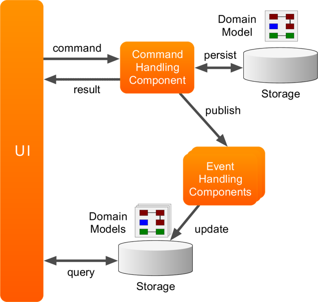

# AXON 

## 1. CQRS  架构



## 2. 基本概念：

### CQRS

QRS 是查询职责分离模式(Command Query Responsibility Segregation)的缩写。将应用程序分为两部分：命令端(Command) 和查询端 (Query)。命令端处理程序创建，更新和删除请求，并在数据更改时发出事件。查询端通过执行查询来处理查询，并且通过订阅数据更改时发出的事件流而保持最新。CQRS使用分离的接口将数据查询操作(Queries) 和数据修改操作(Commands) 分离开来，这也意味着在查询和更新过程中使用的数据模型也是不一样的。这样读和写逻辑就隔离开来了。

传统的 CRUD 适用于小型系统，实现简单、通过代码工具或者 orm 框架能快速实现功能，但是也有一些缺点：

- 使用同一个对象实体来进行数据库读写可能会太粗糙，大多数情况下，比如编辑的时候可能只需要更新个别字段，但是却需要将整个对象都穿进去，有些字段其实是不需要更新的。在查询的时候在表现层可能只需要个别字段，但是需要查询和返回整个实体对象。
- 使用同一实体对象对同一数据进行读写操作的时候，可能会遇到资源竞争的情况，经常要处理的锁的问题，在写入数据的时候，需要加锁。读取数据的时候需要判断是否允许脏读。这样使得系统的逻辑性和复杂性增加，并且会对系统吞吐量的增长会产生影响。
- 同步的，直接与数据库进行交互在大数据量同时访问的情况下可能会影响性能和响应性，并且可能会产生性能瓶颈。
- 由于同一实体对象都会在读写操作中用到，所以对于安全和权限的管理会变得比较复杂。

CQRS 中任一对象的方法可以分为两大类：

- 命令(Command):不返回任何结果(void)，但会改变对象的状态。
- 查询(Query):返回结果，但是不会改变对象的状态，对系统没有副作用。

因此将下面的方法分折成两个：

```java
class Counter{
    private int i = 0;
    public int increase(int value ) {
        i+= value;
        return i;
    }
}
// 将 increase 拆成以下两个方法
public void increaseCommand(int value) {
    i += value
}
public int queryValue() {
    return i;
}

```


CQRS 优缺点：

| 优点                                                         | 缺点                                                         |
| ------------------------------------------------------------ | ------------------------------------------------------------ |
| 分工明确，可以负责不同的部分                                 | 领域模型或者业务逻辑比较简单，这种情况下使用CQRS会把系统搞复杂。 |
| 将业务上的命令和查询的职责分离能够提高系统的性能、可扩展性和安全性。并且在系统的演化中能够保持高度的灵活性，能够防止出现CRUD模式中，对查询或者修改中的某一方进行改动，导致另一方出现问题的情况 | 对于简单的，CRUD模式的用户界面以及与之相关的数据访问操作已经足够的话，没必要使用CQRS |
| 逻辑清晰，能够看到系统中的那些行为或者操作导致了系统的状态变化。 | 不适合在整个系统中到处使用该模式。在整个数据管理场景中的特定模块中CQRS可能比较有用。但是在有些地方使用CQRS会增加系统不必要的复杂性 |
| 可以从数据驱动(Data-Driven) 转到任务驱动(Task-Driven)以及事件驱动([Event-Driven](http://en.wikipedia.org/wiki/Event-driven_programming)) |                                                              |

CQRS 架构


https://www.cnblogs.com/yangecnu/p/Introduction-CQRS.html

### EVENT SOURCING

确保对应用程序状态的所有更改动作都存储为一系列事件，这意味着我们不存储对象的状态，相反，我们存储影响其状态的所有事件（（banq注：状态类似存量，类似账户余额；事件类似流量，类似导致账户余额变动一系列转账事件））。然后，为了检索一个对象状态，我们必须读取与这个对象相关的不同事件，并逐一应用它们。（banq注：账户余额实时计算，不是直接读取某个数据库的字段）。

事件溯源有哪些优点：

1. 事件是不变的，所以可以用只增加的方式去保存。
2. 事件是描述已经发生的事件的简单实体，事件同时也包含一些描述事件的数据。 事件不会直接地把数据库中的数据更新掉，他们只是简单地被储存起来以备使用。这些事件使用和维护起来非常简单。
3. 事件溯源可以防止并发更新造成的冲突因为这种方式防止操作直接去更新数据库中的记录。然而，领域模型必须被设计得能够防止不一致状态的发生。
4. 只增的事件数据存储方式为监视对数据库的操作提供了审查的途径，在任何时候都能通过重现事件的方式以实现物化视图或者规划，并且可以帮助检查和测试系统。并且，一些撤销操作的修正操作可以通过进行历史操作的反向操作来实现，而这个在一个仅仅记录当前状态的系统中是无法实现的。事件的列表也可以用来分析应用程序的性能情况和查看用户的行为趋势，或者用来挖取其他的商业信息。
5. 事件和任务的解耦保证了系统的灵活性和扩展性。例如，一些处理事件的任务仅仅需要考虑事件数据库发布的事件本身属性和描述事件的数据。这种执行任务的方式和引发事件的操作是低耦合的。并且，多个任务都可以处理各自的事件。这样的话方便与其他的服务和系统的合作，只需要监听事件数据库发布的事件就可以了。然而，溯源的事件是在一个很低层次上，有的时候需要产生一系列事件。

事件溯源有哪些缺点：

1. 当创建物化视图或者产生数据规划的时候，系统只会保证数据的最终一致性 。在应用程序向事件数据库中添加处理请求的事件，和事件的发布，和事件的使用者三者之间有一些延迟。在这个延迟的期间，更多新的改变的事件也许会产生并且添加到事件数据库中
2. 事件存储是不变的信息，所以事件数据永远不能被更新修改。唯一一种撤销修改的操作是添加一笔反向操作的事件到数据库中，就像会计中的反向交易一样。如果已经持久化的事件数据的格式（而不是数据本身）需要修改，这就很难把现有的事件和新版本的事件融合起来。这可能必须得遍历所有的事件然后改变他们，再和新事件融合起来，或者创建旧事件的新版本也行。可以考虑使用版本戳（version stamp）来记录不同的事件概要来维护无论是新的还是旧的版本的事件格式。
3. 并没有标准的方法或者固定的机制，例如使用SQL查询，去事件 数据库中获得事件信息。唯一的能获取到的数据是一系列用标识符为标准的的事件。一个事件id都会对应一些各自的实体。 实体的当前状态只能通过重播所有从开始到现在发生的事件获取
4. 当管理和更新系统的时候，事件的长度可能会造成一些问题。 如果事件序列的长度过长，可以考虑通过每经过一定次数的事件进行一个快照。实体的当前状态可以通过获得一个实体的快照，然后把快照事件之后发生的所有事件重播。
5. 事件的发布可能是“至少一次”，所以事件消费者应该是幂等的。

事件溯源：
https://www.infoq.cn/article/2017/09/How-understand-event-traceabilit

https://axoniq.io/resources/event-sourcing

https://www.cnblogs.com/balavatasky/p/5839323.html

### cmmand

通常是一对象，包装一个命令需要的数据

### command Bus 

接收 command  并将它们路由给  command handler。每个 command hanlder 负责处理一个指定类型的 command 。

command handler  可以在 command bus 上订阅和发布特定类型的 command 。 一种类型的命令只能被一种 handler 订阅。

在某些情况下，也可以执行操作逻辑而不管实际的命令类型，如验证、日志或认证。

### command handler 

负责处理 command ,每个 command 只负责处理一种类型的 command 。

### repository 

仓储是提供进入到聚合的一种机制（The repository is the mechanism that provides access to aggregates.）。使用相应的存储机制来持久化数据。在 `CQRS` 中，仓储仅需要提供一个使用标识标发现聚合的方法。

1. stand repositories

   标准仓储存储了聚合的实际状态，每一次更新都会覆盖旧的记录。开箱即用的仓储是 `GenericJpaRepository`，也可以自己实现 `LockingRepository`。

   https://docs.axoniq.io/reference-guide/configuring-infrastructure-components/command-processing/command-model-configuration#standard-repositories

2. event sroucing repositories

   聚合根可以根据事件来重构自己的状态，它们可以使用 event sourcing respositories 来加载。这些仓储不存储聚合本身，而是存储聚合产生的一系列事件，通过这些事件可以在任一时间回放(restored)。`EventSourcingRepository` 提供了事件源仓储的基本功能。

   https://docs.axoniq.io/reference-guide/configuring-infrastructure-components/command-processing/command-model-configuration#event-sourcing-repositories


### aggregate 

在 DDD 的设计中，这是 Aggregate 的标准使用方式：

1. Aggregate 只能通过 repository 装载
2. repository 通常喜欢根据 id 属性来装载 Aggregate
3. Aggregate 不是简单的VO，而是领域对象，不仅仅保持自身的数据和状态，而且有业务方法来实现业务逻辑

axon 中的 Aggregate 不能直接在业务方法中简单的操作自身的状态，即不能直接通过 `this.balanceInCents=***;` 这种方式来修改状态。而是要发送一个 Domain Event 给 Event Bus，然后自己再定义对应的 Event Handler 来处理这个 Domain Event：

### event

这个 Event 指 DDD 中的 Domain Event，按照 DDD 的设计，Aggregate 在状态变更时需要发送 Domain Event 来通知系统中的其他组件（尤其是 Aggregate 自己也不知道到底哪些组件对自己的这个状态变更感兴趣）。

###　Event Bus

Event Bus 将事件分派给所有感兴趣的 Event Listener 。可以是同步或者异步。异步事件分派容许命令执行返回并将控制交还给用户，而事件在后台被分派和处理。不需要等待事件处理完成可以让应用更具响应性。另一方面，同步事件处理更简单，也更容易理解。 同步处理也允许几个Event Listener 处理同一事务中的事件。

### Event Handler

Event Handler 接收并处理事件，这里是主要处理业务逻辑的地方。

一些 Handler 将更新用于查询的数据源，而另外一些发送消息到外部系统。

你可能会注意到，command handle 完全不知道哪些组件会对他们做出的变更感兴趣。这意味着可以以非侵入性的方式来用新功能扩展应用程序。所有需要做的只是添加另一个 Event Handler。事件耦合了应用程序中的所有组件。


### Event Store

Event Store 提供机制，在底层 event storage 中开启流。


### Event Processors

事件处理器是一个更加关注处理的技术组件，它会开启一个 `unitOfWork` 或者 一个事物，确保让相关数据能正确地与关联到事件处理期间创建的所有消息中。

事件处理大致分为两大类：订阅(`subscribing`) 和跟踪 (`Tracking`) 。订阅事件处理器将自己订阅到一个事件源，然后被发布机制管理的线程唤醒。跟踪处理器会在自己管理的线程中拉取事件源的消息。

spring 可以使用 `@Order(integer)` 来定义顺序

### Query handler 

定义一个 queryHandler :

```java
@Component
public class CardSummaryProjection {

    @QueryHandler
    public CardSummary handle(FetchCardSummaryQuery query) {
        CardSummary cardSummary;
        // Retrieve CardSummary instance, for example from a repository. 
        return cardSummary;
    }

}
```

queryHandler 可以有多个。

## 3. 重要注解

### 1） `@Aggragate`

```java
@Target({ElementType.TYPE, ElementType.ANNOTATION_TYPE})
@Retention(RetentionPolicy.RUNTIME)
@Component
@Scope("prototype")
@AggregateRoot
public @interface Aggregate 
```


本质上是一个 spring 的 component 。`CommandGateWay` 调用命令时需要它。

### 2） `@AggregateIdentifier`

标识字段是实体的唯一标识


### 3） `@CommandHandler`

标注对象或者方法做为一个 `CommandHandler`  ，使用 `AnnotationCommandHandlerAdapter` 去订阅 `command bus`。

### 4） `@AggregateMember`

标注在 聚合根里的实体属性上，当聚合根触发一个事件时，首先触发聚合根的事件，然后传播到 `AggregateMember` 中。(When an entity (including the aggregate root) applies an event, it is handled by the aggregate root first, and then bubbles down through every `@AggregateMember` annotated field to **all** its containing child entities:)

```java
import org.axonframework.commandhandling.CommandHandler;
import org.axonframework.modelling.command.AggregateIdentifier;
import org.axonframework.modelling.command.AggregateMember;
import org.axonframework.modelling.command.EntityId;

import static org.axonframework.modelling.command.AggregateLifecycle.apply;

public class GiftCard {

    @AggregateIdentifier
    private String id;
    @AggregateMember
    private List<GiftCardTransaction> transactions = new ArrayList<>();

    @CommandHandler
    public void handle(RedeemCardCommand cmd) {
        // Some decision making logic
        apply(new CardRedeemedEvent(id, cmd.getTransactionId(), cmd.getAmount()));
    }

    @EventSourcingHandler
    public void on(CardRedeemedEvent evt) {
        // 1.
        transactions.add(new GiftCardTransaction(evt.getTransactionId(), evt.getAmount()));
    } 

    // omitted constructors, command and event sourcing handlers 
}

public class GiftCardTransaction {

    @EntityId
    private String transactionId;

    private int transactionValue;
    private boolean reimbursed = false;

    public GiftCardTransaction(String transactionId, int transactionValue) {
        this.transactionId = transactionId;
        this.transactionValue = transactionValue;
    }

    @CommandHandler
    public void handle(ReimburseCardCommand cmd) {
        if (reimbursed) {
            throw new IllegalStateException("Transaction already reimbursed");
        }
        apply(new CardReimbursedEvent(cmd.getCardId(), transactionId, transactionValue));
    }

    @EventSourcingHandler
    public void on(CardReimbursedEvent event) {
        // 2.
        if (transactionId.equals(event.getTransactionId())) {
            reimbursed = true;
        }
    }

    // omitted getter and equals/hashCode
}
```


## 4. 实现 demo

https://git.myscrm.cn/raow/axon-demo

引入依赖，去掉 server 模式连接， 因为 server 模式下需要与 axon 下提供的 `server.jar` 才能跑起来。

```gradle
 implemenation('org.axonframework:axon-spring-boot-starter:4.1.1') {
        exclude group: 'org.axonframework', module: 'axon-server-connector'
    }
```

创建流程

aggregate -> xxxCommander -> CommandHandler-> xxxEvent-> EventHandler(or EventSourcingHandler)。

添加聚合（aggregate ）：

```java


@Getter
@Setter
@AllArgsConstructor
@NoArgsConstructor
@Aggregate
public class ContractAggregate implements ContractInterface {

    @AggregateIdentifier
    private Long identifier;

    private String name;

    private String partyA;

    private String partyB;

    private boolean deleted = false;
}
```

添加一个创建命令：

```java
@Getter
@Setter
@NoArgsConstructor
public class CreateContractCommand extends UpdateContractCommand {

    public CreateContractCommand(Long identifier, String name, String partyA, String partyB) {
        super(identifier, name, partyA, partyB);
    }
}

```

添加创建事件：

```java
@Getter
@Setter
@NoArgsConstructor
public class ContractCreatedEvent extends ContractUpdatedEvent {

    public ContractCreatedEvent(Long identifier, String name, String partyA, String partyB) {
        super(identifier, name, partyA, partyB);
    }
}

```

在 `ContractAggregate` 中添加命令处理器在这个处理器中生成对应的事件：

```java
 @CommandHandler
    public ContractAggregate(CreateContractCommand command, MetaData metaData, UIDGenerator generator) {
        if (null == command.getIdentifier()) {
            command.setIdentifier(generator.getId());
        }
        AggregateLifecycle.apply(new ContractCreatedEvent(command.getIdentifier(), command.getName(), command.getPartyA(), command.getPartyB()), metaData);
    }
```

在 `ContractAggregate` 中添加对应的事件事理器

```java
 @EventSourcingHandler
    private void on(ContractCreatedEvent event) {
        this.setIdentifier(event.getIdentifier());
         this.setName(event.getName());
        this.setPartyA(event.getPartyA());
        this.setPartyB(event.getPartyB());
    }

```

添加查询视图：

```java
@Component
@Slf4j
@AllArgsConstructor
@Transactional
public class ContractViewHandler {

    private final CustomEventSourcingRepository<ContractAggregate> customEventSourcingRepository;

    private final ContractViewRepository contractViewRepository;


    /**
     * 任何 contract 事件发生之后，重新计算 aggregate 的最新状态，转换成 view 之后存储到本地
     *
     * @param event   any event from contract
     * @param message domain event wrapper
     */
    @EventHandler
    public void on(AbstractEvent event, DomainEventMessage<AbstractEvent> message) {


        log.info(MessageFormat.format("{0}: {1} , seq: {2}, payload: {3}", message.getType(), message.getAggregateIdentifier(), message.getSequenceNumber(), message.getPayload()));

        updateContractView(message.getAggregateIdentifier());
    }

    @Transactional
    public void updateContractView(String id) {
        LockAwareAggregate<ContractAggregate, EventSourcedAggregate<ContractAggregate>> lockAwareAggregate = customEventSourcingRepository.load(id);
        ContractAggregate aggregate = lockAwareAggregate.getWrappedAggregate().getAggregateRoot();


        ContractView contractView = contractViewRepository.findById(Long.valueOf(id)).orElse(new ContractView());
        contractView.setId(aggregate.getIdentifier());
        contractView.setDeleted(aggregate.isDeleted());
        contractView.setName(aggregate.getName());
        contractView.setPartyA(aggregate.getPartyA());
        contractView.setPartyB(aggregate.getPartyB());

        contractViewRepository.save(contractView);
    }
}

```

然后写ui层测试：

```java

@RestController
@RequestMapping("/contracts")
@AllArgsConstructor
public class ContractController {

    private final CommandGateway commandGateway;
    private final QueryGateway queryGateway;

    @PostMapping
    public Long createContract(@RequestBody @Valid CreateContractCommand command) {
        return commandGateway.sendAndWait(command);
    }

    @GetMapping("/create")
    public Long create() {
        CreateContractCommand createContractCommand = new CreateContractCommand();
        createContractCommand.setName("test2");
        createContractCommand.setPartyA("test party a----");
        createContractCommand.setPartyB("test part b----");
        return commandGateway.sendAndWait(createContractCommand);
    }
    @PutMapping("/{id}")
    public void updateContract(@PathVariable("id") Long id, @RequestBody @Valid UpdateContractCommand command) {
        command.setIdentifier(id);
        commandGateway.send(command);
    }

    @DeleteMapping("/{id}")
    public void deleteContract(@PathVariable("id") Long id) {
        commandGateway.send(new DeleteContractCommand(id));
    }

    @GetMapping("/{id}")
    public ContractAggregate getContract(@PathVariable("id") Long id) {
        QueryContractCommand command = new QueryContractCommand(id, Instant.now());

        return queryGateway.query(command, ContractAggregate.class).join();
    }
}

```

参考：

https://docs.axoniq.io/reference-guide/configuring-infrastructure-components/command-processing/command-dispatching

https://www.jdon.com/49501

https://blog.csdn.net/qq_16681169/article/details/81605250

http://www.uml.org.cn/zjjs/201609221.asp

https://www.jianshu.com/p/4a7854e4b8f2

https://github.com/soooban/AxonDemo

