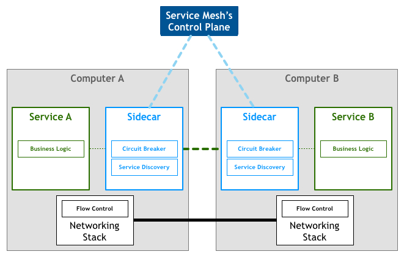

# Istio 入门

##　什么是服务网格(Service Mesh)

下面是Willian Morgan 的 [文章](https://buoyant.io/2017/04/25/whats-a-service-mesh-and-why-do-i-need-one/) 对 Service Mesh 的解释。

```
A Service Mesh is a dedicated infrastructure layer for handling service-to-service communication. It’s responsible for the reliable delivery of requests through the complex topology of services that comprise a modern, cloud native application. In practice, the Service Mesh is typically implemented as an array of lightweight network proxies that are deployed alongside application code, without the application needing to be aware.
```

翻译成中文如下：

```
服务网格（Service Mesh）是致力于解决服务间通讯的基础设施层。它负责在现代云原生应用程序的复杂服务拓扑来可靠地传递请求。实际上，Service Mesh 通常是通过一组轻量级网络代理（Sidecar proxy），与应用程序代码部署在一起来实现，而无需感知应用程序本身。
```

Service Mesh 有如下特点：

* 应该程序间通讯的中间层
* 轻量级网格代理
* 应用程序无感知
* 解耦应用程序的重试、超时、监控、追踪和服务发现

目前两款流行的 Service Mesh 开源软件 分别是[Istio](https://istio.io/) 和 [Linkerd](https://linkerd.io/)。

Service Mesh 架构图如下：




## Istio 是什么

istio 是用来创建具胡负载均衡、服务间认证、监控等功能的服务网格，而不需要对服务的代码进行任何修改。只需要在部署环境中，如 k8s 的 pod 里注入一个特别的 sidecar proxy 来增加对 istio 的支持。用来截获微服务这间的网络流量。

### istio 四大特性：


1. 流量控制
2. 授权认证
3. 策略实施
4. 监控

https://istio.io/

### 支持平台

* Kubernetes
* 使用 Consul 注册的服务
* 运行在独立虚拟机上的服务

### 架构

istio 在逻辑上分为数据层(data plane) 和 控制层(control plane)。

* 数据层是由一系列部署在边车(sidecar)上的智能代理([Envoy](https://www.envoyproxy.io/)) 组成。这些代理调解和控制微服务间的所有网络连接
* 控制层管理和配置这些代理去做流量路由。


### 组件

#### Envoy

Envoy 是用 c++ 编写的一个高性能代理。istio 使用 Envoy 的很多内置功能，例如：

* 动态服务发现
* 负载均衡
* 终结TLS?（TLS termination）
* Http/2 和 gRPC 代理
* 健康检查
* 按百分比分割流量
* 故障注入
* 丰富的仪表盘

#### Mixer 

Mixer 是一个平台独立的组件。Mixer 在服务网格中实施访问控制和使用策略，并从 Envoy 代理和其它服务中遥测数据。代理会扩展求的属性然后把它们发送到 Mixer  计算。

#### Pilot

为 Envoy 边车提供服务发现功能。为路由提供流量管理功能，以及resiliency 如 超时，重试，熔断等功能 

Pilot 将流量控制行为的高级路由规则转换为Enovy特定的配置，并在运行时将它们转播到 sidecars。

#### Citadel

Citadel 通过内置身份和凭证管理实现服务到服务和最终用户身份验证。

#### Galley

Galley 是 istio 的配置验证，提取、处理和分发组件


## 使用 Minikube 安装 istio

1. 安装 minikube

2. 启动 

   ```shell
   minikube start 
   ```

3. 下载 istio 

   ```shell 
   curl -L https://git.io/getLatestIstio | ISTIO_VERSION=1.3.0 sh -
   cd istio-1.3.0
   # 安装 `install\kubernetes` 中所有的 yaml 文件
   # 将 istioctl 放到 path 中。
   ```

4. 安装  demo 配置文件

   ```shell
    kubectl apply -f install/kubernetes/istio-demo.yaml
    # 验证
    kubectl get pods -n istio-system
    # 清除
    kubectl delete -f install/kubernetes/istio-demo.yaml
   ```

5. 注入 istio 

   ```shell
   kubectl label namespace <namespace> istio-injection=enabled
   ```

6. 部署应用

   ```shell
   kubectl apply -f samples/bookinfo/platform/kube/bookinfo.yaml
   # 验证
   kubectl get services
   kubectl get pods
   kubectl exec -it $(kubectl get pod -l app=ratings -o jsonpath='{.items[0].metadata.name}') -c ratings -- curl productpage:9080/productpage | grep -o "<title>.*</title>"
   
   ```

7. 部署 ingress 

   ```bash
   kubectl apply -f samples/bookinfo/networking/bookinfo-gateway.yaml
   ## 验证
   curl -s http://${GATEWAY_URL}/productpage | grep -o "<title>.*</title>"
   ```

8. 清除

   ```shell
    samples/bookinfo/platform/kube/cleanup.sh
    kubectl get virtualservices   #-- there should be no virtual services
    kubectl get destinationrules  #-- there should be no destination rules
    kubectl get gateway           #-- there should be no gateway
    kubectl get pods              #-- the Bookinfo pods should be deleted
   
   ```

   